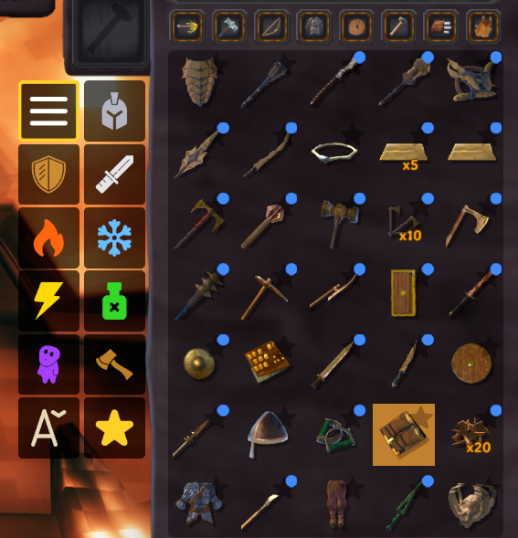
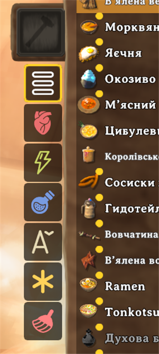

# CraftSort

**Sort crafting recipes by stats — one click, instant order.**

Revival of the deprecated SortCraft mod. Adds icon tab buttons to the left side of every crafting station. Click to sort, click again to toggle off.




---

## ⚡ Features

- **15 sort modes** — food stations show 6 tabs, combat stations show 12 in a 2×6 grid
- **Auto food/combat detection** — works with any modded station by inspecting recipe content
- **New recipe indicator** — blue dot on unviewed recipes + "New" filter tab
- **Per-character persistence** — tracked per save file
- **AAA Crafting compatible** — global sort across paginated pages
- **Client-side only** — no server mods required

## 📊 Sort Modes

| Icon | Sorts by | Icon | Sorts by |
|:----:|----------|:----:|----------|
| All | Default order | HP | Food health |
| Armor | Armor value | Stam | Food stamina |
| Block | Block power | Eitr | Food eitr |
| Phys | Blunt+Slash+Pierce | A→Z | Localized name |
| Fire | Fire damage | New | Unviewed only |
| Frost | Frost damage | | |
| Ltng | Lightning damage | | |
| Psn | Poison damage | | |
| Sprt | Spirit damage | | |
| Chop | Chop damage | | |

## 🔧 Configuration

`BepInEx/config/dev.craftsort.cfg`

| Setting | Default | Description |
|---------|---------|-------------|
| `Enabled` | `true` | Enable or disable the mod |
| `DefaultSortMode` | `None` | Sort mode on panel open |
| `RememberLastMode` | `false` | Keep last mode between stations |

## ✅ Compatibility

Tested with Valheim **0.221.13** (Unity 6).

**Compatible:** VNEI, Jewelcrafting, Recycle N Reclaim, AAA Crafting, CraftingFilter, CraftingSearchBar, MyLittleUI, SortedMenus, BetterArchery, EpicLoot, PlantEverything

**Incompatible:** InventorySlots (replaces the crafting UI entirely)

## 🛠 How It Works

- **Transpiler** on `InventoryGui.UpdateRecipeList` injects sort before vanilla's positioning loop
- **AAA Crafting**: separate Prefix sorts `RecipeListPerfCache.CraftSortedFiltered` before pagination
- **Food detection**: three-layer check (UI recipes → ObjectDB → name fallback) by item type & food stats
- **Blue dots**: Postfix on `UpdateRecipeList` + `OnSelectedRecipe` for tracking viewed recipes

## 📦 Building from Source

```bash
dotnet build CraftSort/CraftSort.csproj -c Debug
```

Requires .NET 8 SDK. Output: `CraftSort/bin/Debug/net48/CraftSort.dll`

---

## 💬 Feedback & Contact

Found a bug, have an idea, or want to request compatibility with another mod? Reach out:

- **Discord:** [@mr_grandpa_oldman](https://discord.gg/29J7ygQ8R3)
- **Telegram:** [@mr_grandpa_oldman](https://t.me/mr_grandpa_oldman)

---

## ☕ Support

> I'm a simple engineer who has fun after work writing mods to improve the gaming experience. If you liked the mod, you can thank me, I'd be happy to.

[](https://ko-fi.com/grandpa_ai)

---

## 📄 License

AGPL-3.0
